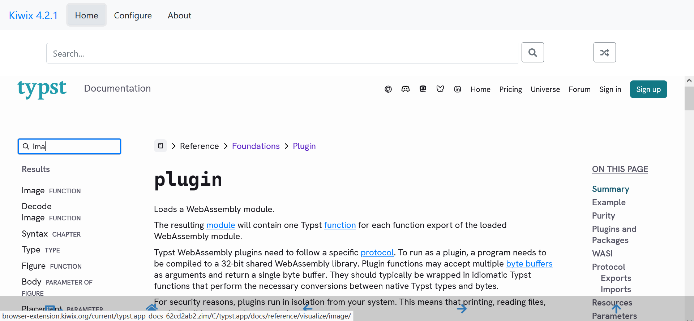

# Snapshots of Docs

This page lists _unofficial_ snapshots of the official [Typst Documentation](https://typst.app/docs/) for reading offline ([#2089](https://github.com/typst/typst/issues/2089 "Typst documentation available offline? · Issue #2089 · typst/typst")) or using previous versions ([#5387](https://github.com/typst/typst/issues/5387 "Hosted documentation of previous versions · Issue #5387 · typst/typst")).

Download links (each one is ~15 MB):

- [v0.14.2 (retrieved on 2025-12-19)](./typst.app_docs_v0.14.2_b1dfeb16-2025-12-19.zim)
- [v0.14.1 (retrieved on 2025-12-10)](./typst.app_docs_v0.14.1_d825dd38-2025-12-10.zim)
- [v0.14.0 (retrieved on 2025-11-04)](./typst.app_docs_v0.14.0_7248b445-2025-11-04.zim)
- [v0.13.1 (retrieved on 2025-09-11)](./typst.app_docs_v0.13.1_62cd2ab2-2025-09-11.zim)

The above `*.zim` files were created by running [Zimit](https://zimit.kiwix.org) against [typst.app/docs](https://typst.app/docs/).

To view the contents, you will need a ZIM file reader, which usually means [Kiwix](https://kiwix.org/en/applications/).
The screenshot below shows how it looks in the [Kiwix Firefox extension](https://addons.mozilla.org/en-US/firefox/addon/kiwix-offline/). It's in the browser, but totally offline, and even the search box works.
Kiwix is also available on other browsers, desktop computers, mobile devices, and more platforms.

## See also

- [typst-docs-web](https://typst-docs-web.netlify.app/) hosts multiple versions of the Typst documentation, but in an alternative layout and with full-text search.

- [🏗 Documentation infrastructure — Best of Typst (TCDM)](https://ydx-2147483647.github.io/best-of-typst/#docs-infra) lists more tools for building the Typst documentation.

